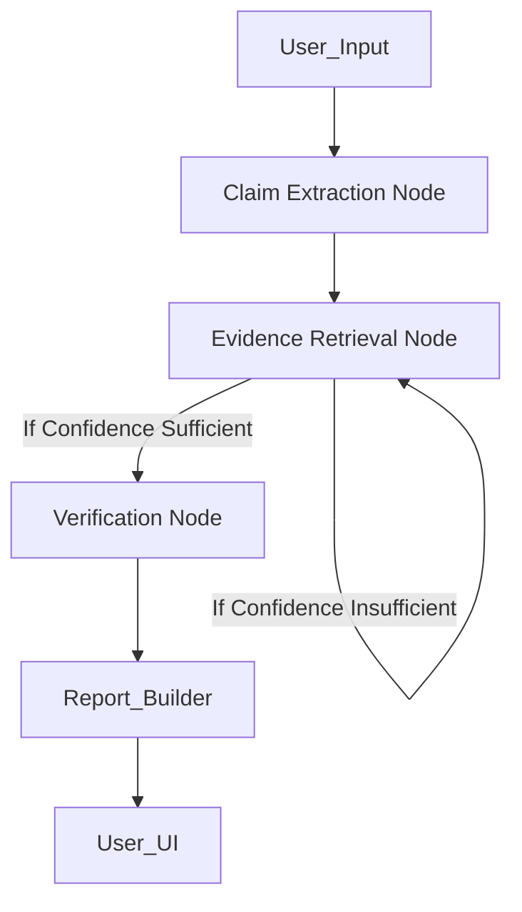

# ⚡ Aletheia
### AI-Driven Fact-Check & Claim Verification System
*Ἀλήθεια — "the state of not being hidden; truth, disclosure, revelation"*


## Features
- **Multi-agent LangGraph Pipeline:** (Extract → Retrieve → Verify) orchestrates the lifecycle of fact-checking safely.
- **Concurrent FIRE Iterative Retrieval:** Processes multiple claims completely in parallel using `asyncio` threadpools with DuckDuckGo Search.
- **Instant Demo Cache:** Pre-seeded fallback database for presentation examples allowing <1 second resolution.
- **Real-time SSE Streaming:** Provides immediate, step-by-step UI progress feedback to users alongside dynamic AnimeJS vector morphing.
- **Source Credibility Weighting:** Ranks sources intelligently (High/Medium/Low) based on domain trust algorithms.
- **Temporal Sensitivity Detection:** Detects date-sensitive keywords like "latest" and injects current-year parameters.
- **AI-generated Text Detection:** Integrates GPTZero to parse and flag synthetic sentences.
- **Deepfake/Media Detection:** Leverages Hive AI to assess deepfake confidence in image sources.
- **AthenaGuard Compliance:** Meets premium enterprise readiness standards across data-sanitization, security configurations, and rate limits.

## Tech Stack
  
 
  

## Setup
**1. Clone the repository**
```bash
git clone https://github.com/rehaan-ahmad/aletheia.git
cd aletheia
```

**2. Setup Backend Environment**
```bash
cd backend
python -m venv venv
source venv/bin/activate
pip install -r requirements.txt
cp ../.env.example ../.env
```
Populate `.env` with actual `GEMINI_API_KEY`, `GPTZERO_API_KEY`, and `HIVE_API_KEY`. (Note: DuckDuckGo search is completely free and requires no key).

**3. Run the Backend API**
```bash
uvicorn main:app --reload
```

**4. Install Frontend Dependencies**
```bash
cd ../frontend
npm install
```

**5. Start the frontend**
```bash
npm run dev
```

## Security (AthenaGuard)
We prioritized security and robustness from hour one:
- **Rate-Limiting:** `slowapi` enforces strict hourly/minute caps across verification streams and auth routes respectively.
- **XSS Protection:** Enforced `DOMPurify` HTML string sanitation with allowed/denied tags across evidence renderers and URL link verification blocks.
- **Dependency Guarding:** Validated dependencies using `pip-audit` & `npm audit`.
- **Secret Management:** Integrated `gitleaks` as a `pre-commit` hook to continuously check for hardcoded secrets and tokens inline.
- **CORS/CSP Policies:** Added strict header injection for API endpoints, isolating resources from unknown cross-domain invocation risks.

## Architecture
**LangGraph Orchestration Pipeline**

